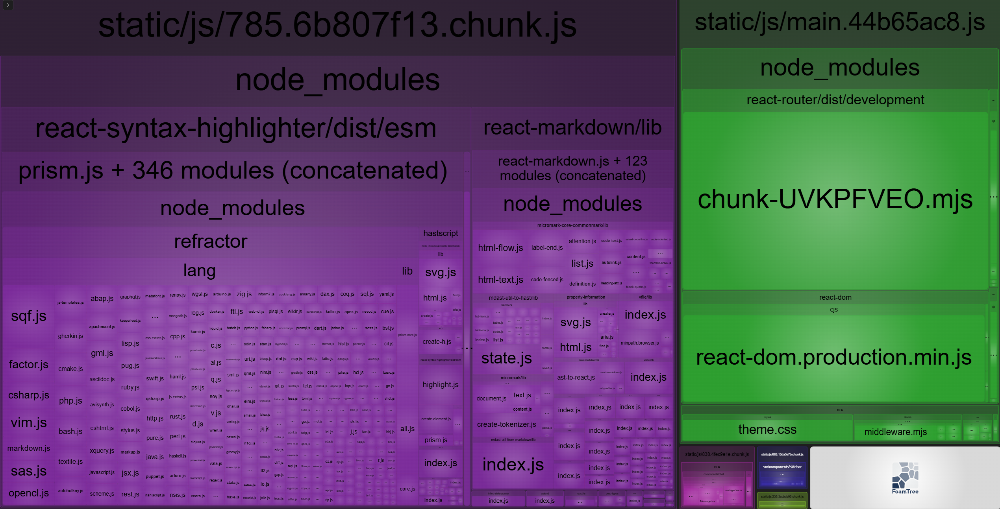

# Чат с ИИ (GigaChat)

React-приложение для общения с GigaChat API.

---

## Демо
> сслыка на versel

Скриншот работающего приложения:



---

## Стек

| Технология | Версия |
|---|---|
| React | ^18.0.0 |
| TypeScript | ^4.0.0 |
| React Router DOM | ^7.13.2 |
| Zustand | ^5.0.12 |
| react-markdown | ^8.0.0 |
| react-syntax-highlighter | ^16.1.1 |
| CSS (custom properties) | — |

---

## Запуск локально

```bash
# 1. Клонировать репозиторий
git clone https://github.com/DITLEKS/front_hw.git
cd front_hw

# 2. Установить зависимости
npm install

# 3. Создать файл переменных окружения
cp .env.example .env
# Заполните .env своими данными GigaChat

# 4. Запустить прокси-сервер (нужен для GigaChat API)
npm run server

# 5. В другом терминале — запустить React-приложение
npm start
```

Приложение откроется по адресу: http://localhost:3000

---

## Переменные окружения

| Переменная | Описание | Обязательна |
|---|---|---|
| `REACT_APP_API_BASE_URL` | URL прокси-сервера | Нет (по умолчанию `http://localhost:3002`) |
| `GIGACHAT_AUTH_KEY` | Base64-строка `ClientId:ClientSecret` от GigaChat | Да |
| `GIGACHAT_SCOPE` | Скоуп API (`GIGACHAT_API_PERS` для физлиц) | Да |

---

## Оптимизации

### Code Splitting (React.lazy + Suspense)
- `ChatWindow` — ленивая загрузка, отдельный JS-чанк
- `SettingsPanel` — ленивая загрузка (открывается редко)
- `Sidebar` — ленивая загрузка в AppLayout

### Мемоизация
- `ChatItem` обёрнут в `React.memo` — не перерисовывается при изменении другого чата
- `filteredChats` в Sidebar через `useMemo` — пересчёт только при изменении списка или поискового запроса
- Обработчики `handleSend`, `handleDelete`, `handleEdit`, `handleSelect` через `useCallback`

### ErrorBoundary
- Компонент `ErrorBoundary` (`componentDidCatch`) изолирует ошибки рендера
- `MessageList` обёрнут в `ErrorBoundary` — ошибка в сообщениях не ломает сайдбар
- Кнопка «Повторить» позволяет сбросить состояние ошибки
- Ошибки API-запросов показываются полосой под чатом, не через ErrorBoundary

---

## Тестирование

```bash
# Запуск тестов (watch-режим)
npm test

# Однократный запуск
CI=true npm test -- --watchAll=false
```

**Покрытие (53 теста):**
- `chatReducer` — ADD_CHAT, ADD_MESSAGE, DELETE_CHAT, UPDATE_CHAT
- `storage` — localStorage: сохранение, восстановление, битый JSON
- `InputArea` — отправка по кнопке и Enter, блокировка пустого поля
- `Message` — CSS-классы user/assistant, кнопка копирования
- `Sidebar` — поиск в реальном времени, подтверждение удаления

---

## Структура проекта

```
src/
├── app/router/routes.tsx          # lazy-роуты
├── components/
│   ├── chat/
│   │   ├── ChatWindow.tsx         # useCallback, ErrorBoundary, lazy SettingsPanel
│   │   ├── InputArea.tsx
│   │   ├── Message.tsx
│   │   └── MessageList.tsx
│   ├── layout/AppLayout.tsx       # lazy Sidebar
│   ├── settings/SettingsPanel.tsx
│   ├── sidebar/
│   │   ├── ChatItem.tsx           # React.memo
│   │   └── Sidebar.tsx            # useMemo, useCallback
│   └── ui/
│       └── ErrorBoundary.tsx      # классовый компонент, componentDidCatch
├── stores/chatStore.ts
├── utils/storage.ts
docs/
├── bundle-analysis.png
.env.example
vercel.json
```
