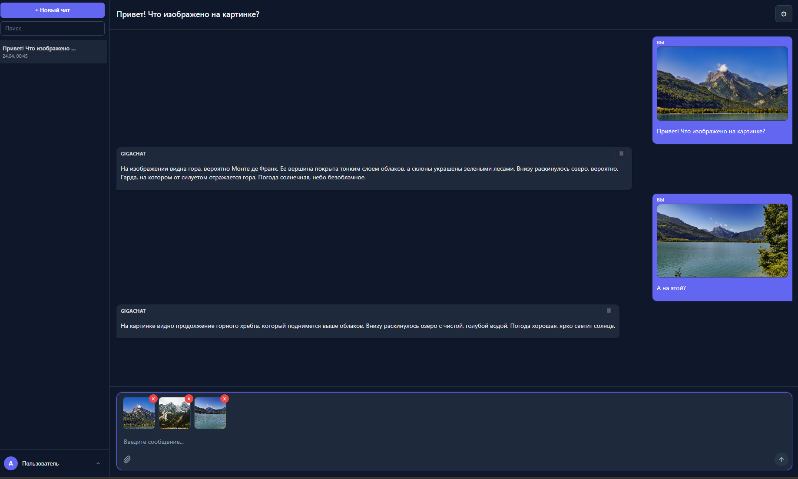
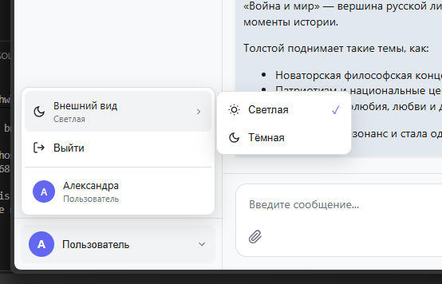
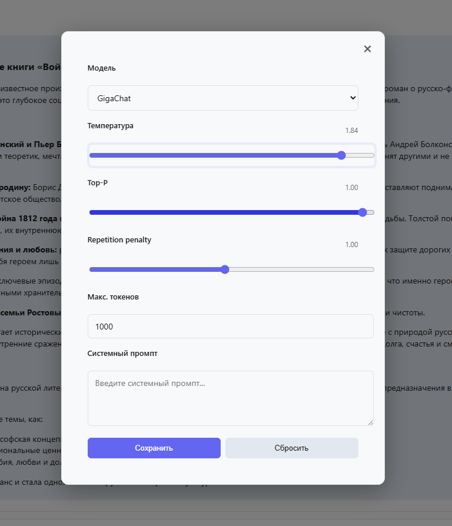

# Чат с ИИ (GigaChat)

React-приложение для общения с GigaChat API.

---

## Демо

**https://front-hw-one.vercel.app**

> Авторизуйтесь через форму входа, создайте новый чат и начните общение с GigaChat.  
> Для анализа изображений должна быть выбрана модель с поддержкой vision.

### Скриншоты

**Страница входа**  


**Главная страница**  


**Отправка изображения в чат**  


**Настройки темы**  


**Тёмная тема**  


**Основные настройки**  


---

## Возможности

- Авторизация с простым входом по логину и паролю
- Создание, удаление и переименование чатов
- Поддержка Markdown в ответах модели
- Подсветка блоков кода
- Светлая и тёмная тема
- Настройка параметров генерации
- Отправка изображений в чат
- Работа через прокси-сервер для безопасного обращения к GigaChat API

---

## Стек

| Технология | Версия |
|---|---|
| React | 18.x |
| TypeScript | 4.x |
| React Router DOM | 7.x |
| Zustand | 5.x |
| react-markdown | 8.x |
| react-syntax-highlighter | 16.x |
| CSS (custom properties) | — |
| Express | 4.x |
| node-fetch | 2.x |

---

## Запуск локально

```bash
# 1. Клонировать репозиторий
git clone https://github.com/DITLEKS/front_hw.git
cd front_hw

# 2. Установить зависимости
npm install --legacy-peer-deps

# 3. Настроить переменные окружения
cp .env.example .env
# Откройте .env и заполните:
# - REACT_APP_API_BASE_URL: URL вашего сервера (по умолчанию http://localhost:3002)
# - GIGACHAT_TOKEN: Base64-encoded client_id:client_secret для OAuth

# 4. Запустить прокси-сервер
node server.js

# 5. Запустить React-приложение
npm start
```

Приложение будет доступно по адресу: **http://localhost:3000**  
Прокси-сервер будет доступен по адресу: **http://localhost:3002**

---

## Переменные окружения

| Переменная | Описание | Где используется |
|---|---|---|
| `GIGACHAT_TOKEN` | Base64-строка `client_id:client_secret` для получения OAuth access token | `server.js` |
| `REACT_APP_API_BASE_URL` | Базовый URL прокси-сервера | React-приложение |
| `PORT` | Порт прокси-сервера, по умолчанию `3002` | `server.js` |

---

## Оптимизации

- **React.lazy + Suspense** — `ChatWindow`, `SettingsPanel`, `Sidebar` загружаются отдельными JS-чанками
- **React.memo** — `ChatItem` не перерисовывается при изменении другого чата
- **useMemo** — фильтрация чатов в поиске не пересчитывается без изменений
- **useCallback** — обработчики мемоизированы
- **ErrorBoundary** — ошибки в области сообщений не ломают остальной интерфейс

---

## Тестирование

```bash
# Запуск тестов
npm test

# Однократный запуск без watch-режима
CI=true npm test -- --watchAll=false
```

### Что покрыто тестами

- **chatReducer** — ADD_CHAT, ADD_MESSAGE, DELETE_CHAT, UPDATE_CHAT, SET_ACTIVE_CHAT
- **InputArea** — отправка по кнопке и Enter, блокировка пустого ввода, кнопка «Стоп»
- **Message** — рендер user/assistant-сообщений, кнопка копирования только у assistant
- **Sidebar** — поиск по названию и содержимому, удаление, переименование
- **SettingsPanel** — рендер, сохранение, сброс, смена модели
- **settings utils** — localStorage: сохранение, восстановление, обработка битых данных

---

## Деплой

- **Frontend** — Vercel
- **Proxy server** — Node.js server (`server.js`)
- **Сборка** — через `nixpacks.toml`, стартовая команда: `node server.js`[cite:1]

---
