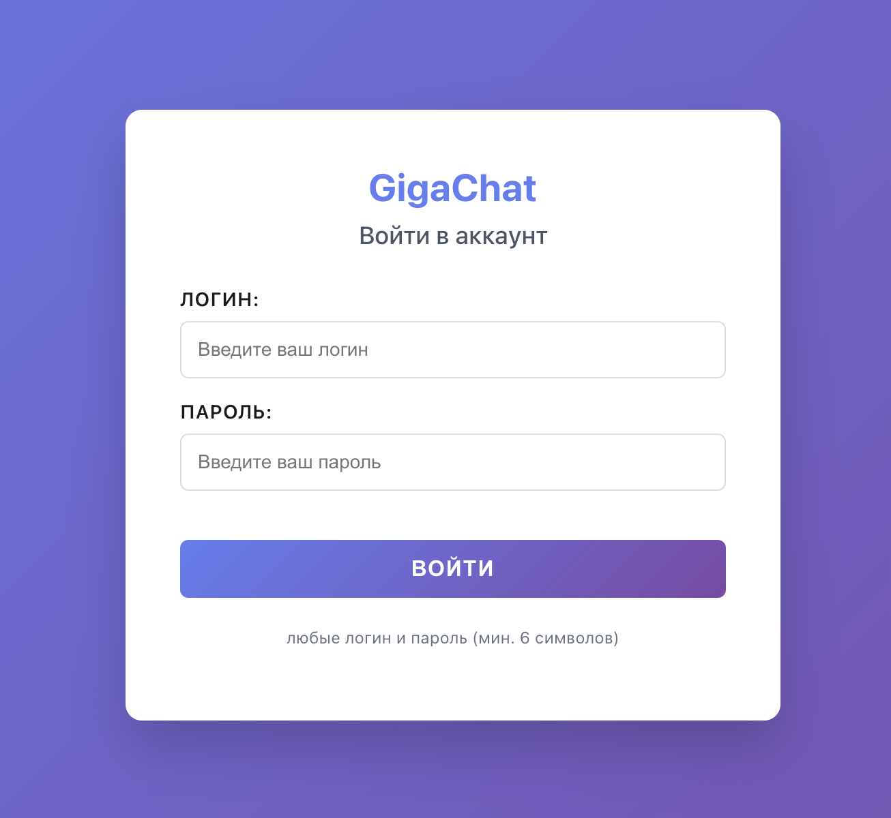
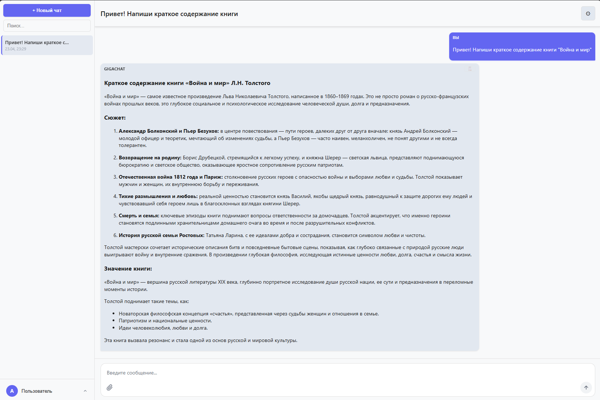
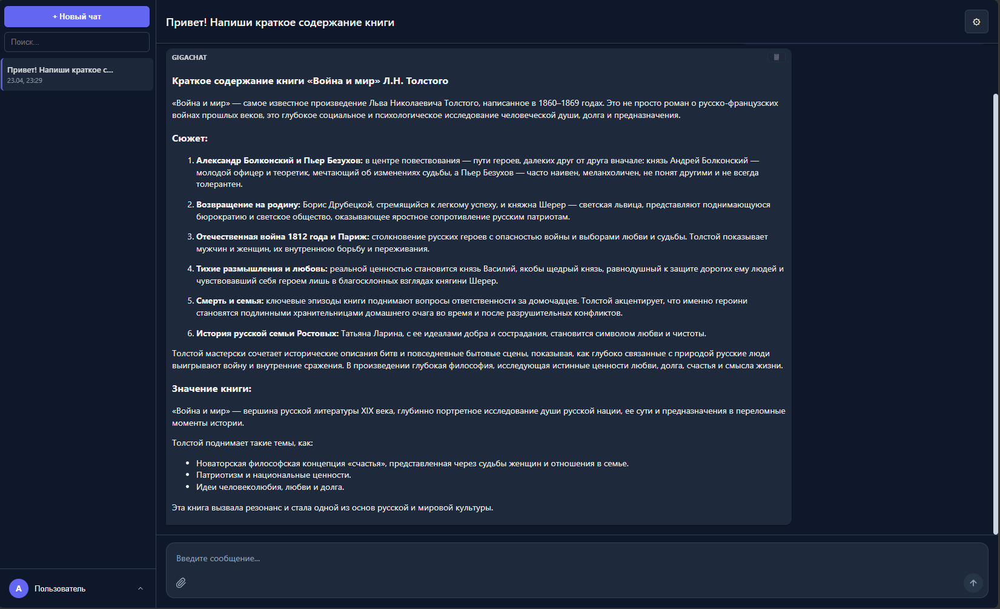
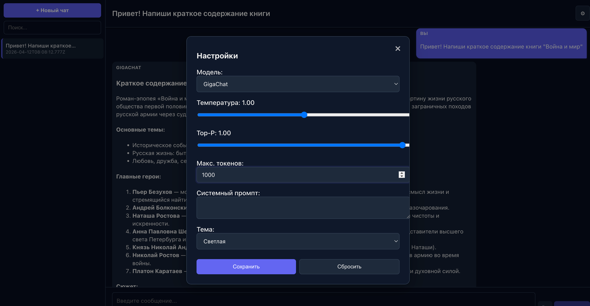

# 💬 Чат с ИИ (GigaChat)

React-приложение для общения с GigaChat API.

---

## Демо

**https://front-hw-one.vercel.app**

> Войдите с любым логином и паролем (мин. 6 символов), создайте новый чат и начните общение с GigaChat.

| Страница входа | Главная страница | Тёмная тема | Настройки |
|---|---|---|---|
|  |  |  |  |

---

## 🛠 Стек

| Технология | Версия |
|---|---|
| React | 18.x |
| TypeScript | 4.x |
| React Router DOM | 7.x |
| Zustand (стейт-менеджер) | 5.x |
| react-markdown | 8.x |
| react-syntax-highlighter | 16.x |
| CSS (custom properties) | — |

---

## Запуск локально

```bash
# 1. Клонировать репозиторий
git clone https://github.com/DITLEKS/front_hw.git
cd front_hw

# 2. Установить зависимости
npm install --legacy-peer-deps

# 3. Настроить переменные окружения
cp .env.example .env
# Откройте .env и заполните:
# - REACT_APP_API_BASE_URL: URL вашего сервера (по умолчанию http://localhost:3002)
# - GIGACHAT_TOKEN: Base64-encoded client_id:client_secret для OAuth

# 4. Запустить прокси-сервер (в отдельном терминале)
npm run server

# 5. Запустить React-приложение
npm start
```

Приложение откроется по адресу: **http://localhost:3000**

---

## Переменные окружения

| Переменная | Описание | Где используется |
|---|---|---|
| `GIGACHAT_TOKEN` | Base64-строка `ClientId:ClientSecret` от GigaChat API | `server.js` (Railway) |
| `REACT_APP_API_BASE_URL` | URL задеплоенного сервера (Railway) | React-приложение (Vercel) |
| `PORT` | Порт прокси-сервера (по умолчанию 3002) | `server.js` (Railway) |

---

## Оптимизации

- **React.lazy + Suspense** — `ChatWindow`, `SettingsPanel`, `Sidebar` загружаются отдельными JS-чанками
- **React.memo** - `ChatItem` не перерисовывается при изменении другого чата
- **useMemo** - фильтрация чатов в поиске не пересчитывается без изменений
- **useCallback** - обработчики `handleSend`, `handleDelete`, `handleEdit` мемоизированы
- **ErrorBoundary** - ошибки в области сообщений не ломают сайдбар, есть кнопка «Повторить»

---

## Тестирование

```bash
# Запуск тестов
npm test

# Однократный запуск без watch-режима
CI=true npm test -- --watchAll=false
```

Покрыто 53 тестами: reducer, localStorage, InputArea, Message, Sidebar.
